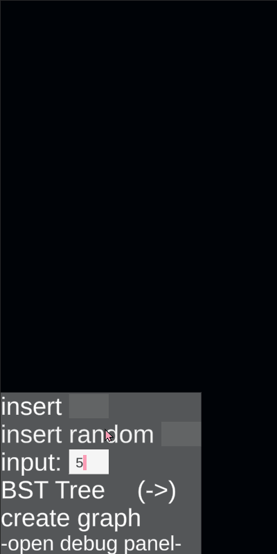
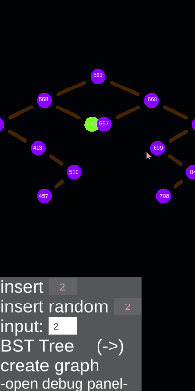

# graphAndTrees
Cellphone app intended to visualize some data structures currently: bst, avl & directed graph

---
```
stuff to do:
❌bug in avl tree, it breaks when 2 nodes overlap when rotating
✔(FIXED)currently each graph node can only have 1 inner edge
❌no animations
❌no music
```

## Demo

### Directed Graph

 `it uses dijkstra algorithm to find the shortest path from node selected(pink node) before clicking the min search button, to the one clicked after.`
 
<p align="center">
  
</p>

---

### Binary Search Tree

 `the tree preserves correct structure after each insertion/deletion.`
 
<p align="center">
  
  
</p>

---

### AVL Tree

 `the tree stays balanced doing rotations if needed after each insertion/deletion.`

<p align="center">
  
  
</p>

---

